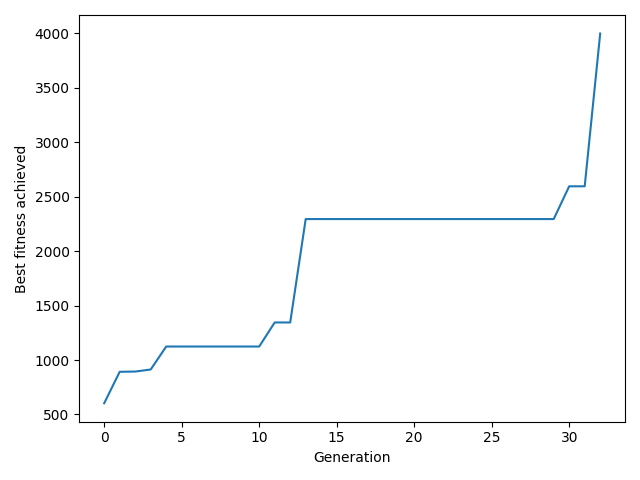
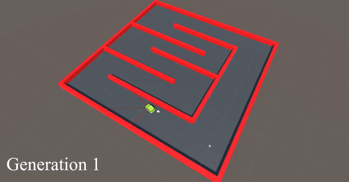
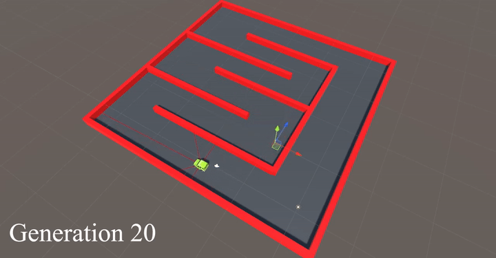
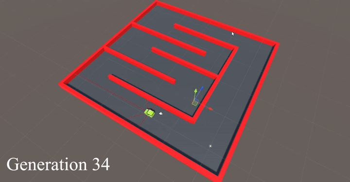

# NNSelfDrivingCar : Self Driving Car using Unity3D
> A fully self driving car in Unity from scratch using Neural Networks and Genetic Algorithms inspired by [AJTech's series of tutorials](https://www.youtube.com/watch?v=C6SZUU8XQQ0&list=PL9FeLoYIHiTwyS18t1RUJQCKFy_abl3qe&ab_channel=AJTechAJTech).

## How it works
We consider a population of cars.   Each car is controlled by a MLP (multi-layer perceptron) which initialy has random weights. At each frame, the entry of this MLP is the distance between the car and 5 points towards it (see the red lines below) and the outputs allow to chose between accelerating or not (from 1 to 0), and turning left or right (from 1 to -1).   Then, the car travels through the circuit and gets a score - fitness- which corresponds to the distance travelled by the car. Of course, the car is instantly killed when touching a wall or if the fitness reach a threshold put to 4000. 
Once every car of the population has obtained its fitness, the best ones are kept, some of the best ones are selected to create new individuals slightly modified (small random modification of the values of their weights), and finally, the worst cars are reinitialized (weights are randomized). 
This process is repeated for a number of iterations called "Generations".
 
 
In this project, every parameter is adjustable within both the neural network driving cars and the genetic algorithm handling the population of cars.

## Results
This figure shows the evolution of the best fitness achieved according to the generation, until the best fitness possible is reached at generation 34.  

Here is a [video](https://www.youtube.com/watch?v=EZHOONPLUZg) showing different generation : 
 

 
A great example of AI being smarter than the circuit builder.

## Requirements
Unity3D is required to use this project.

## Contact
For any remarks or issues, contact me at: <contact.keyofmagic@gmail.com>
